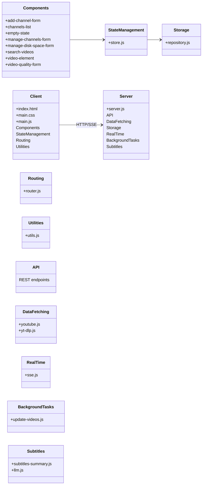

# my-yt Application Architecture

## Component Relationships

- Client communicates with Server via HTTP/SSE protocols
- UI Components utilize centralized state management
- Server handles data fetching, storage, real-time updates, and background processing
- Subtitles processing leverages LLM integration for summarization
