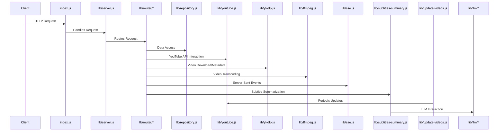
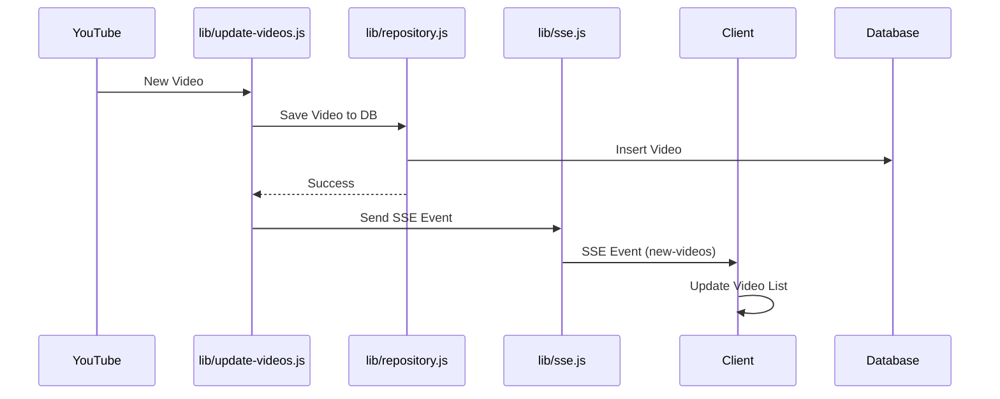
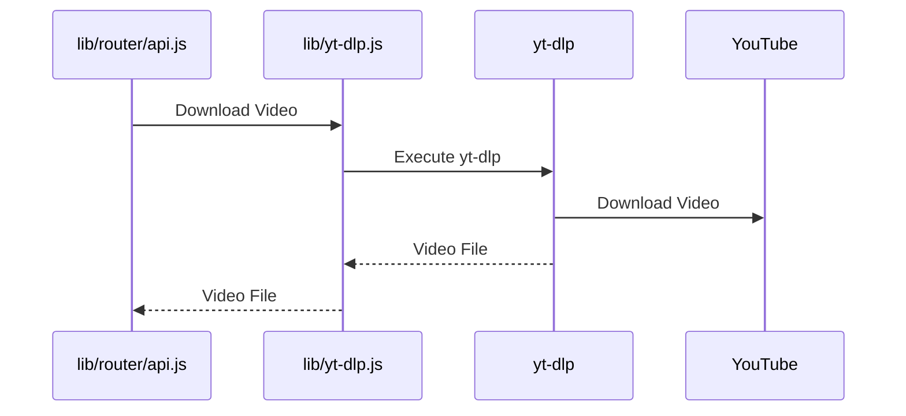

# Server-Side Architecture

This document describes the architecture of the server-side code.

## Overall Flow



## Component Breakdown

1.  **`index.js`**

    - **Purpose:** Entry point of the application. Sets up the Express server, connects to the database, and initializes the routes.
    - **Implementation:**
      - Imports necessary modules.
      - Connects to the database using `lib/repository.js`.
      - Initializes the Express app using `lib/server.js`.
      - Starts the server and listens for incoming requests.

2.  **`/lib/server.js`**

    - **Purpose:** Contains the core server logic, including setting up the Express app, defining API endpoints, and handling requests.
    - **Implementation:**
      - Creates an Express app instance.
      - Defines middleware for request handling (e.g., CORS, JSON parsing).
      - Mounts the API routes defined in `/lib/router/*`.
      - Handles errors and sends appropriate responses.

3.  **`/lib/router/*`**

    - **Purpose:** Defines the API routes for various functionalities like adding channels, managing videos, and handling settings.
    - **Implementation:**

      - Each file in this directory represents a specific set of API endpoints.
      - Uses Express Router to define routes and their corresponding handlers.
      - Interacts with other modules like `lib/repository.js`, `lib/youtube.js`, `lib/yt-dlp.js`, `lib/ffmpeg.js`, `lib/sse.js`, and `lib/subtitles-summary.js` to handle requests.

    - **Example Flow (Adding a Channel):**

      ```mermaid
      sequenceDiagram
          participant Client
          participant lib/router/api.js
          participant lib/repository.js
          participant lib/youtube.js
          Client->>lib/router/api.js: POST /api/channels
          lib/router/api.js->>lib/youtube.js: Fetch Channel Info
          lib/youtube.js->>YouTube API: Get Channel Details
          lib/youtube.js-->>lib/router/api.js: Channel Info
          lib/router/api.js->>lib/repository.js: Save Channel
          lib/repository.js->>Database: Insert Channel
          lib/repository.js-->>lib/router/api.js: Success
          lib/router/api.js->>lib/sse.js: Notify Client
          lib/sse.js->>Client: SSE Update
      ```

4.  **`/lib/repository.js`**

    - **Purpose:** Handles database interactions, providing functions for storing and retrieving data.
    - **Implementation:**
      - Uses a database client (e.g., SQLite) to connect to the database.
      - Provides functions for CRUD operations on various data entities (e.g., channels, videos, settings).
      - Abstracts the database implementation from other modules.

5.  **`/lib/youtube.js`**

    - **Purpose:** Interacts with the YouTube API to fetch channel information and video metadata.
    - **Implementation:**
      - Uses the YouTube API client to make requests to the YouTube API.
      - Provides functions for fetching channel details, video metadata, and playlist items.
      - Handles API authentication and error handling.

6.  **`/lib/yt-dlp.js`**

    - **Purpose:** Uses the `yt-dlp` library to download videos and extract metadata.
    - **Implementation:**
      - Provides functions for downloading videos from YouTube and other platforms.
      - Extracts metadata from videos, such as title, description, and thumbnails.
      - Handles `yt-dlp` execution and output parsing.

7.  **`/lib/ffmpeg.js`**

    - **Purpose:** Uses the `ffmpeg` library to transcode videos.
    - **Implementation:**
      - Provides functions for transcoding videos to different formats and resolutions.
      - Handles `ffmpeg` execution and output parsing.
      - Used to convert videos to a more web-friendly format.

8.  **`/lib/sse.js`**

    - **Purpose:** Implements server-sent events (SSE) for real-time updates to the client.
    - **Implementation:**

      - Manages a list of connected clients.
      - Sends SSE messages to clients to notify them of events, such as new videos, download progress, and summarization status.
      - Uses the `EventSource` API on the client-side to receive SSE messages.

    - **SSE Flow:**

      ```mermaid
      sequenceDiagram
          participant Server
          participant Client
          Server->>Client: Establish SSE Connection
          Server->>Client: SSE Message (e.g., new video)
          Client->>Client: Update UI
      ```

9.  **`/lib/subtitles-summary.js`**

    - **Purpose:** Generates summaries of video subtitles using LLMs.
    - **Implementation:**
      - Extracts subtitles from videos using `yt-dlp`.
      - Sends the subtitles to an LLM (e.g., OpenAI) for summarization.
      - Returns the summary to the client.

10. **`/lib/update-videos.js`**

    - **Purpose:** Periodically updates the video list for subscribed channels.
    - **Implementation:**
      - Fetches the latest videos from YouTube for each subscribed channel.
      - Saves the new videos to the database.
      - Sends SSE messages to clients to notify them of the new videos.
      - Runs as a background task using a scheduler (e.g., `node-cron`).

11. **`/lib/llm/*`**

    - **Purpose:** Handles interactions with Large Language Models (LLMs) for tasks like summarization.
    - **Implementation:**
      - Provides a generic interface for interacting with different LLM providers (e.g., OpenAI, Anthropic).
      - Handles API authentication and request formatting.
      - Parses the LLM responses and returns the results.

## Server-Side Event Flow

Server-side events are used to push real-time updates to the client. The following diagram illustrates the flow of server-side events:



## yt-dlp Usage

`yt-dlp` is used to download videos and extract metadata. The following diagram illustrates the usage of `yt-dlp`:


